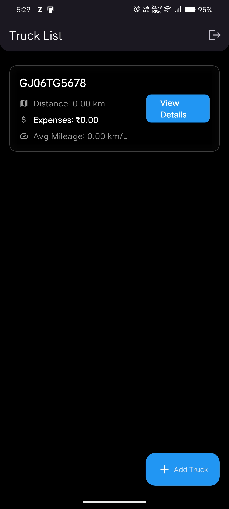
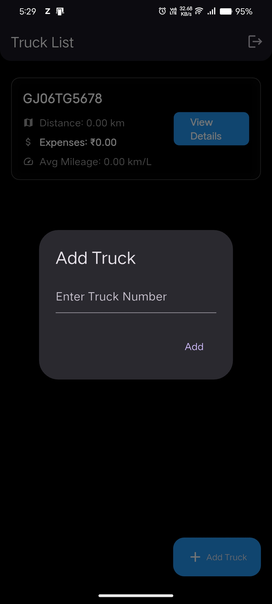
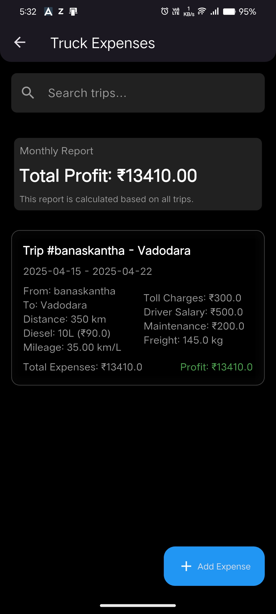
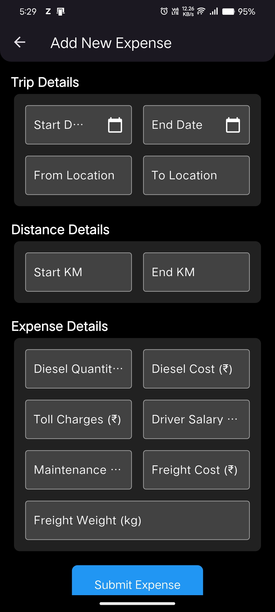
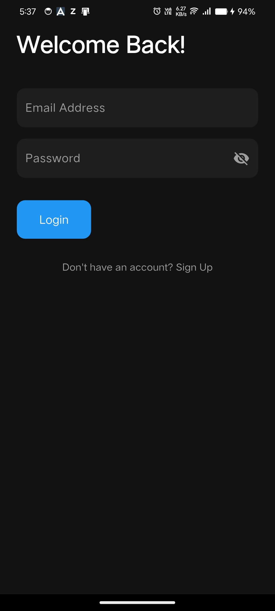
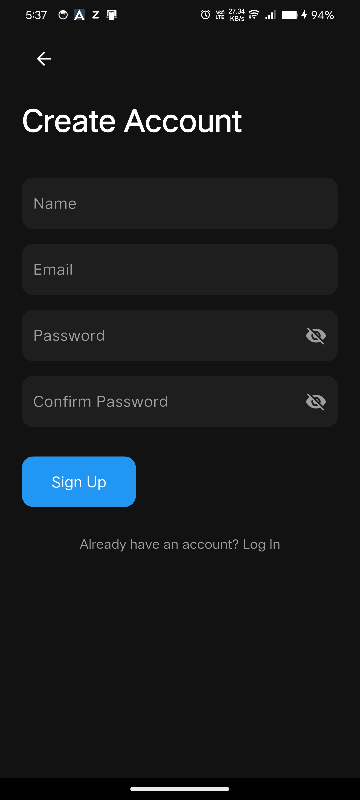

# Truck Expense Management Application

A comprehensive Flutter-based application designed to manage truck expenses efficiently. This app enables users to track trips, calculate expenses, monitor profits or losses, and generate detailed reports for better financial management.

---

## Features

### Core Features
- **Truck Management**: Add, edit, and view a list of trucks with details like registration number, model, and capacity.
- **Expense Tracking**: Record detailed expenses for each trip, including:
  - Diesel costs
  - Toll charges
  - Driver salary
  - Maintenance
  - Freight charges
- **Profit/Loss Calculation**: Automatically calculate profit or loss for each trip based on income and expenses.
- **Search Functionality**: Search trips by "from" or "to" locations for quick access.
- **Monthly Report**: View a summary of total profit or loss for all trips in a selected month.

### Additional Features
- **User Authentication**: Multi-user support with login and signup functionality. Each user can manage their own trucks and expenses securely.
- **Responsive Design**: Optimized for all screen sizes, including mobile, tablet, and desktop.
- **Firebase Integration**: Securely store and retrieve data using Firebase services.


## Installation

### Prerequisites
- Flutter SDK installed on your system.
- A Firebase project set up with Firestore enabled.

### Steps
1. Clone the repository:
   ```bash
   git clone https://github.com/chirag640/truck-expense.git
   ```
2. Navigate to the project directory:
   ```bash
   cd truck-expense-management
   ```
3. Install dependencies:
   ```bash
   flutter pub get
   ```
4. Configure Firebase:
   - Set up a Firebase project in the [Firebase Console](https://console.firebase.google.com/).
   - Add Android and iOS apps to the Firebase project.
   - Replace the `firebase_options.dart` file with your Firebase configuration.
5. Run the app:
   ```bash
   flutter run
   ```

---

## Screenshots

Here are some screenshots of the application:

<table>
  <tr>
    <td><b>Home Screen</b></td>
    <td><b>Add Truck</b></td>
    <td><b>Expense Tracking</b></td>
  </tr>
  <tr>
    <td></td>
    <td></td>
    <td></td>
  </tr>
  <tr>
    <td><b>Add Expense</b></td>
    <td><b>Login</b></td>
    <td><b>Signup</b></td>
  </tr>
  <tr>
    <td></td>
    <td></td>
    <td></td>
  </tr>
</table>

---

## Dependencies

- **Flutter**: Framework for building the app.
- **Firebase**: Backend services for authentication, Firestore, and storage.
- **Cloud Firestore**: Database for storing truck and expense data.
- **Shared Preferences**: For storing user session data locally.
- **Intl**: For date and number formatting.

---

## How to Use

1. **Sign Up/Login**: Create an account or log in using the authentication system.
2. **Add a Truck**: Click the "+" button on the home screen to add a new truck. Provide details like registration number, model, and capacity.
3. **View Truck Details**: Tap on a truck to view its trip expenses and overall profit/loss.
4. **Add Expense**: Click the "+" button on the truck expense page to add a new trip expense. Fill in details like trip distance, diesel cost, toll charges, and freight income.
5. **Search Trips**: Use the search bar on the truck expense page to find trips by "from" or "to" locations.
6. **View Monthly Report**: Navigate to the "Reports" section to view a graphical summary of profits and losses for a selected month.
7. **Logout**: Use the logout button in the home screen to securely log out of your account.
8. **Back Navigation**: The app prevents navigation back to the login or register page using the back button unless you explicitly log out.

---

## Firebase Configuration

This app uses Firebase for backend services. Follow these steps to configure Firebase:

1. Create a Firebase project in the [Firebase Console](https://console.firebase.google.com/).
2. Add your Android and iOS apps to the Firebase project.
3. Download the `google-services.json` file for Android and `GoogleService-Info.plist` for iOS.
4. Place these files in the respective directories:
   - `android/app/` for `google-services.json`
   - `ios/Runner/` for `GoogleService-Info.plist`
5. Replace the `firebase_options.dart` file in the project with your Firebase configuration.

---

## Roadmap

- **Upcoming Features**:
  - Integration with GPS for automatic trip distance calculation.
  - Push notifications for reminders and updates.
  - Advanced analytics for expense trends and predictions.

---

## License

This project is licensed under the MIT License. See the [LICENSE](LICENSE) file for details.

---

## Author

Developed by Chirag. For any queries, feel free to reach out at Chaudharychirag640@gmail.com.
